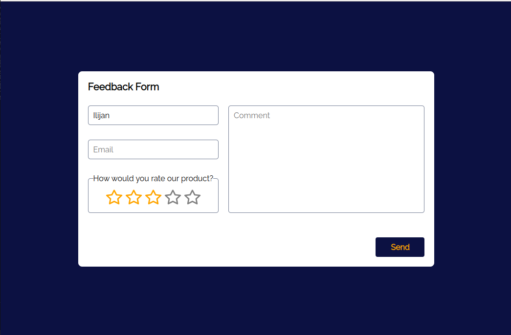
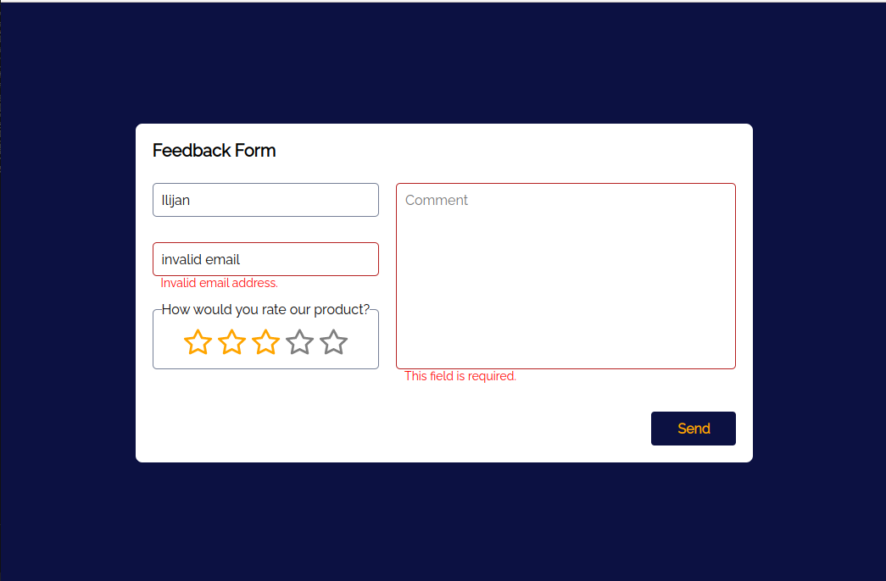
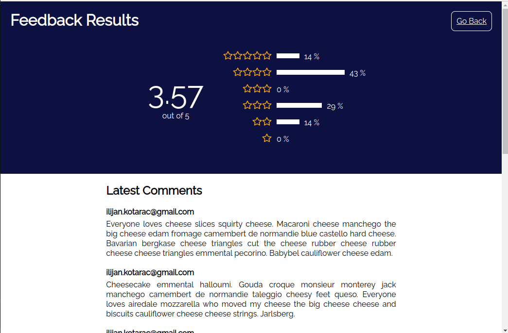

# Feedback Form Task

## How to run

Run `yarn` to install all dependencies, and then `yarn dev` to run development server.

Run `yarn test` to run the tests.

## Screenshots

## App Structure

Application is written as a set of modules, analogous to NPM packages. Modules can freely import from each other, taking care not to make circular dependencies.

Inside every module there are `components`, `fragments` and `services` subfolders.

`/components` folder contains reuseable components that don't hold any business logic. Any feature-specific copy and API calls are omitted here. These components offer rendering logic and basic interactivity, for example, `StarRatingInput` is a component.

`/fragments` folder contains 'smart' components that can hold business logic. These components are points of integration of different features. API calls are made here, imports from other modules happen here.

`/services` folder contains helpers, mappers and hooks.

## Application Modules

Here's a quick breakdown of application modules:

- Application entry point is the `main` module.
- `feedback` module takes care of collecting user feedback.
- `ui-components` module contains reuseable UI components that make up a small design system used by the app.
- `testing-utils` module contains utilities used for testing, such as `TestingProvider`, a wrapper component containing all providers required to get the application up and running.

## Potential improvements

- Improve accessibility of `BarChart` component.
- Test application using screen readers.
- Clean up CSS, extract more values into theme - such as spacings, colors, typography.
- Units based on viewport height are unreliable on mobile safari, Send button sometimes ends up below the fold.

